# Residual-CFO Stage 1 Linear Report

- Output directory: `/Users/saksh/Documents/Local Documents/ibm/ofdm/residualCFO/idea3_stage2_awgn/stage1_linear_outputs/16qam_n44_r6`
- Modulation: `16QAM`

Script-only Stage 1 linear learned-transceiver package for the structured `16QAM` experiment.
This output folder includes the saved Stage 1 checkpoint consumed by the Stage 2 nonlinear workflows.

## Configuration

- Output dir: `/Users/saksh/Documents/Local Documents/ibm/ofdm/residualCFO/idea3_stage2_awgn/stage1_linear_outputs/16qam_n44_r6`
- Base seed: `211`
- Frame: `M=64, K=50, N=44, P=4, G=10, R=6`
- Train SNR: `15.0 dB`, train range `[10.0, 18.0] dB`, eval SNR `12.0 dB`
- Stage epochs: `A=350, B=650, C=900`
- Stage CFO spans: `B=0.05, C=0.10`
- Acceptance gates: clean identity `<= 1.0e-03`, clean leakage `<= 1.0e-03`
- Losses: `lambda_0=1.0`, `lambda_1=0.9`, `lambda_2=0.18`, `lambda_3=0.0005`, `lambda_sym=1.25`, `lambda_nn=1.1`
- CFO support weights: `-0.10:0.20, -0.07:0.35, -0.05:1.20, -0.04:1.45, -0.03:1.60, -0.02:1.40, -0.01:1.10, +0.01:1.10, +0.02:1.40, +0.03:1.60, +0.04:1.45, +0.05:1.20, +0.07:0.35, +0.10:0.20`
- Eval grids: operator `41`, BER `41`, SNR sweep `11`
- Eval batches: BER blocks `32768`, constellation blocks `512`, spectral blocks `4096`, PAPR blocks `4096`
- Structured occupancy: learned-data `0.781`, information `0.688`, guard `0.156`

## Mapping Summary

**Structured K-Bin Symbol-to-Waveform Mapping**

$x = W s = \sum_{k=0}^{43} s_k w_k$

- `s` is a length-`44` vector of unknown complex `16QAM` data symbols.
- `W` has shape `(64, 44)`, and each learned basis column is constrained to the same `50`-bin structured subspace.
- The `64`-bin frame is split into `50` learned-data bins, `4` reserved pilot bins, and `10` guard bins.
- Classical OFDM uses `44` fixed contiguous data tones inside that `50`-bin structured subspace, while the learned waveform spreads the same `44` data symbols across the full `50`-dimensional subspace.
- The in-band redundancy is `R = K - N = 6`.
- Reserved pilot tones are held aside for future work and are not used for estimation in this notebook.

## Run Summary

**Stage 1 Linear Comparison Summary**
- Configuration: `16QAM`, `N=44`, `M=64`, training `15 dB`, evaluation `12 dB`.
- Resource split: `K=50` learned-data bins, `P=4` reserved pilot bins, `G=10` guard bins, `R=6` redundancy, structured occupancy `50/64 = 0.781`, information occupancy `44/64 = 0.688`.
- Training status: `Completed all stages.`
- Stage 1 acceptance: `PASS`. Clean identity <= `1.0e-03`, clean leakage <= `1.0e-03`, learned BER(0) <= `7.629e-04`. Result: `Completed all stages. Stage 1 acceptance passed.`
- Stage A: clean identity `6.3014e-04`, clean leakage `3.7500e-04`, symbol loss `1.2281e-02`, `||V||_F^2=4.2614e+01`.
- Stage B: clean identity `7.6650e-04`, clean leakage `3.8820e-04`, symbol loss `2.3789e-02`, `||V||_F^2=4.2433e+01`.
- Stage C: clean identity `8.2204e-04`, clean leakage `3.7017e-04`, symbol loss `4.1399e-02`, `||V||_F^2=4.2370e+01`.
- Zero CFO BER: learned `1.767e-04` vs classical OFDM `1.314e-04`.
- CFO-robust BER score: learned `-0.5998` vs classical OFDM `-0.5709`.
- Integrated off-diagonal leakage: learned `3.7347e-04` vs classical OFDM `8.0412e-03`.
- Small/mid-CFO nearest-neighbor leakage: learned `2.7706e-05` vs classical OFDM `1.1238e-03`.
- EVM at CFO `0.10`: learned `0.3296` vs classical OFDM `0.3737`.
- Robustness window BER <= `0.01`: learned `|delta|<=0.040` vs classical OFDM `|delta|<=0.040` (gain `+0.0%`).
- Robustness window BER <= `0.1`: learned `|delta|<=0.110` vs classical OFDM `|delta|<=0.090` (gain `+22.2%`).
- BER-vs-SNR at CFO `0.00`: learned `-75.8969` vs classical OFDM `-76.5977`.
- BER-vs-SNR at CFO `0.05`: learned `-34.5102` vs classical OFDM `-33.9214`.
- BER-vs-SNR at CFO `0.10`: learned `-20.3603` vs classical OFDM `-18.3344`.
- 99% occupied bandwidth: learned `0.7932` vs classical OFDM `0.7014`.
- Out-of-band power ratio: learned `1.7727e-02` vs classical OFDM `3.7214e-03`.
- PAPR 95th percentile: learned `7.02 dB` vs classical OFDM `8.41 dB`.

## Data Artifacts

- `ber_csv`: [ber_vs_cfo.csv](ber_vs_cfo.csv)
- `ber_snr_csv`: [ber_vs_snr_by_cfo.csv](ber_vs_snr_by_cfo.csv)
- `constellation_csv`: [constellation_snapshots.csv](constellation_snapshots.csv)
- `diagonal_csv`: [diagonal_magnitudes.csv](diagonal_magnitudes.csv)
- `history_csv`: [stage_training_history.csv](stage_training_history.csv)
- `operator_csv`: [operator_diagnostics.csv](operator_diagnostics.csv)
- `papr_csv`: [papr_samples.csv](papr_samples.csv)
- `papr_summary_csv`: [papr_summary.csv](papr_summary.csv)
- `snr_summary_csv`: [ber_vs_snr_slice_summary.csv](ber_vs_snr_slice_summary.csv)
- `spectral_csv`: [spectral_psd.csv](spectral_psd.csv)
- `spectral_summary_csv`: [spectral_summary.csv](spectral_summary.csv)
- `stage_summary_csv`: [stage_summary.csv](stage_summary.csv)
- `summary_csv`: [summary_metrics.csv](summary_metrics.csv)

## Model Artifacts

- `stage1_checkpoint`: [stage1_checkpoint.pt](stage1_checkpoint.pt)

## Figures

### Ber Vs Cfo

[ber_vs_cfo.png](ber_vs_cfo.png)

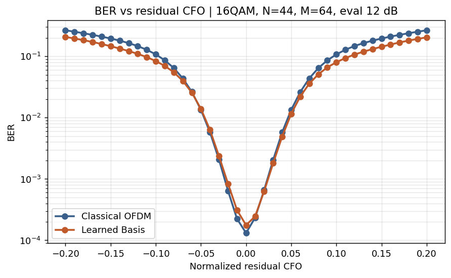

### Ber Vs Snr By Cfo

[ber_vs_snr_by_cfo.png](ber_vs_snr_by_cfo.png)

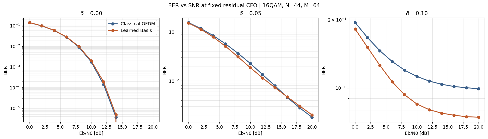

### Offdiag Leakage Vs Cfo

[offdiag_leakage_vs_cfo.png](offdiag_leakage_vs_cfo.png)

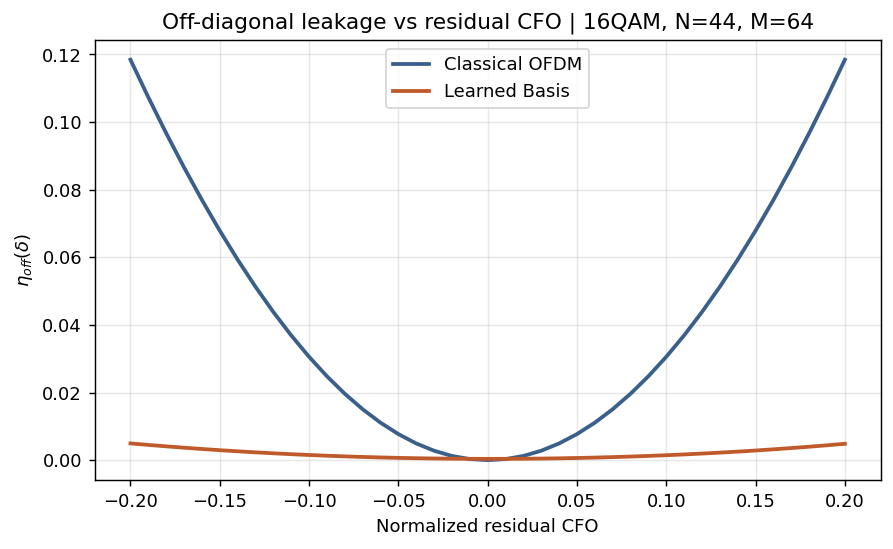

### Nearest Neighbor Leakage Vs Cfo

[nearest_neighbor_leakage_vs_cfo.png](nearest_neighbor_leakage_vs_cfo.png)

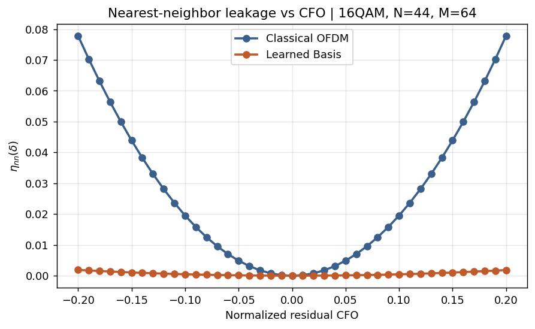

### Evm Vs Cfo

[evm_vs_cfo.png](evm_vs_cfo.png)

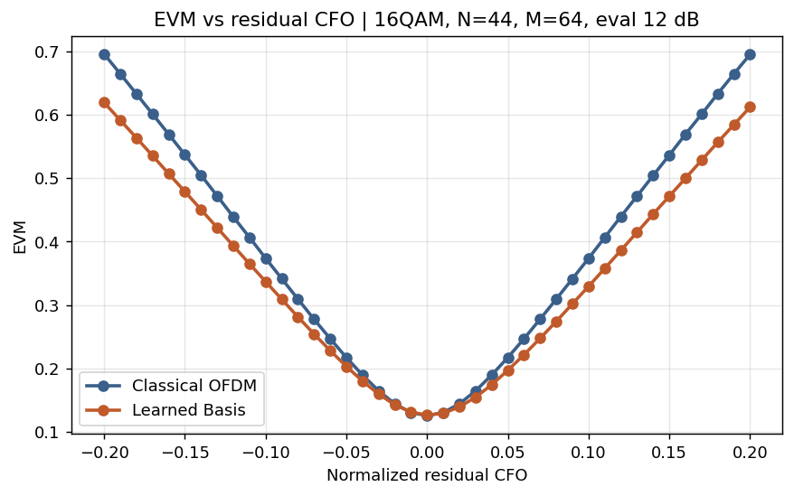

### Constellation Snapshots

[constellation_snapshots.png](constellation_snapshots.png)

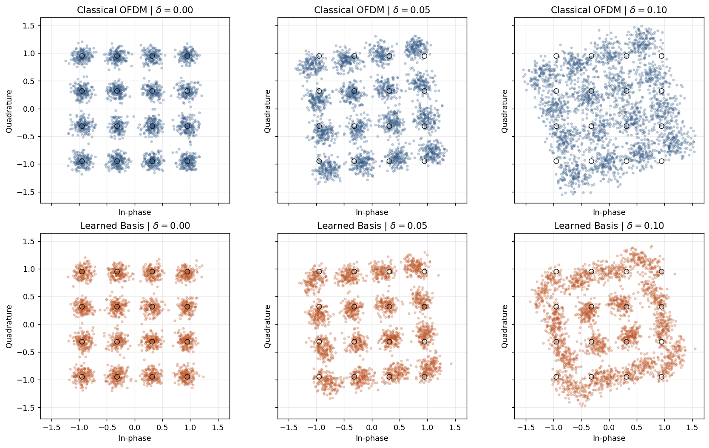

### Operator Heatmaps

[operator_heatmaps.png](operator_heatmaps.png)

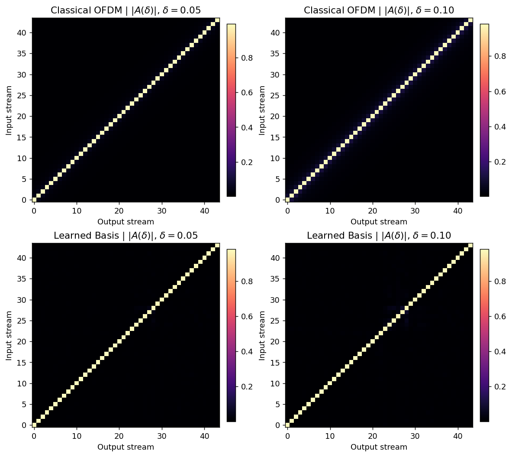

### Spectral Fairness

[spectral_fairness.png](spectral_fairness.png)

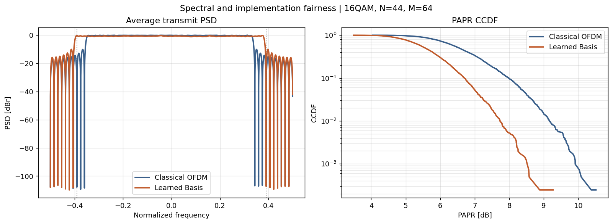

### Papr Ccdf

[papr_ccdf.png](papr_ccdf.png)

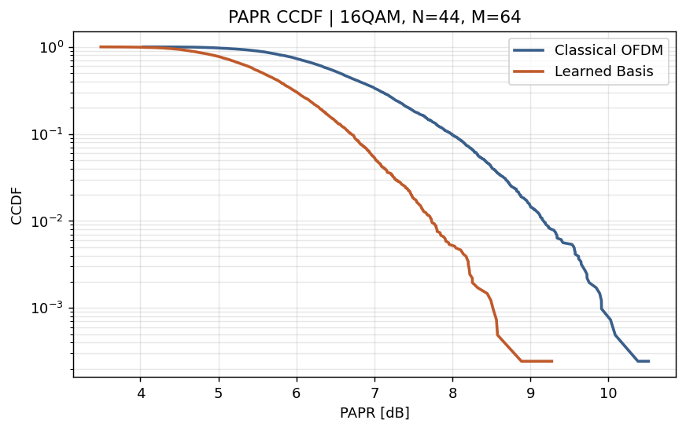

### Frequency Domain Bases All

[frequency_domain_bases_all.png](frequency_domain_bases_all.png)

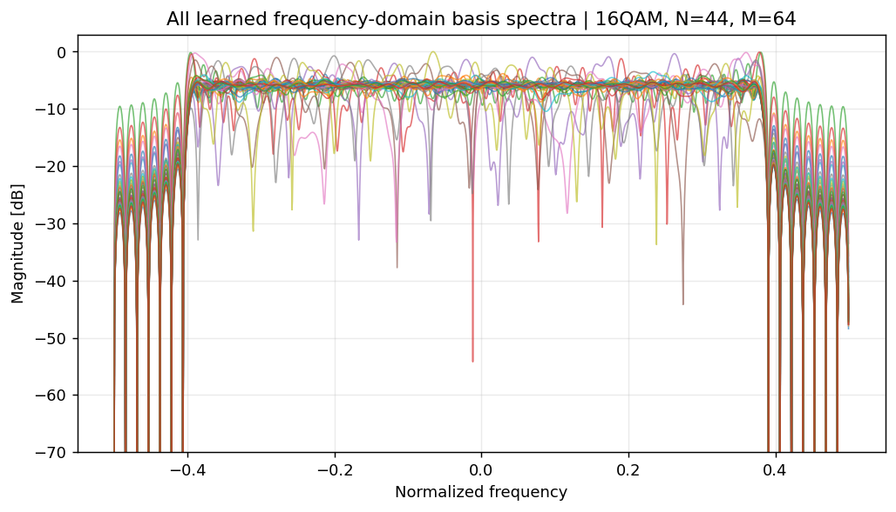

### Frequency Domain Bases Random

[frequency_domain_bases_random.png](frequency_domain_bases_random.png)

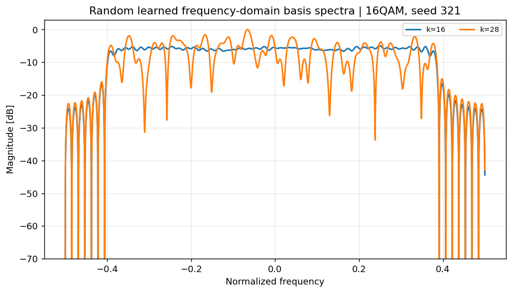

### Time Domain Waveform

[time_domain_waveform.png](time_domain_waveform.png)

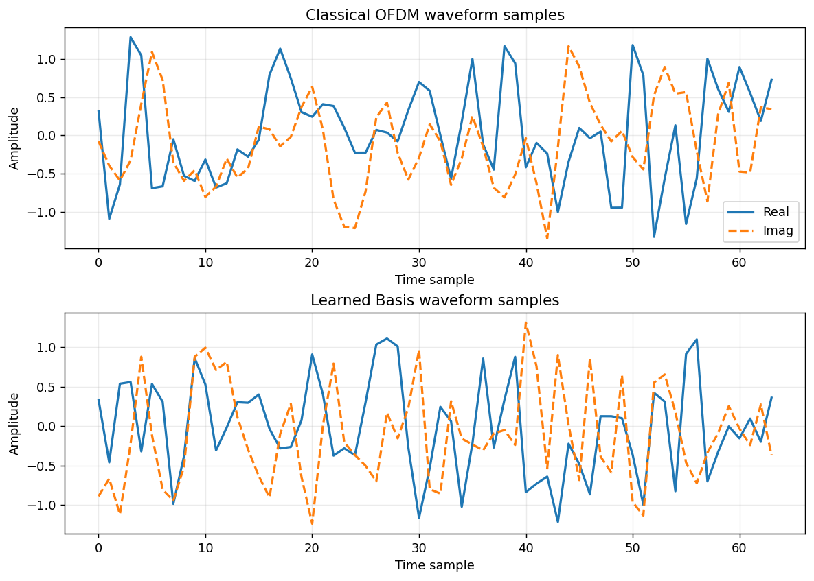

### Time Domain Envelope Phase

[time_domain_envelope_phase.png](time_domain_envelope_phase.png)

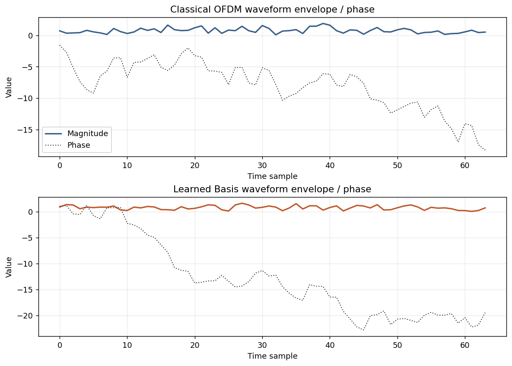
