# Residual-CFO Stage 2 Joint Report

- Output directory: `/Users/saksh/Documents/Local Documents/ibm/ofdm/residualCFO/idea3_stage2_awgn/stage2_nonlinear_outputs/joint`
- Modulation: `16QAM`

Script-only Stage 2 joint package for the structured `16QAM` experiment.
This workflow warm-starts the nonlinear detector, bridges with `W` frozen, then runs full joint refinement.

## Configuration

- Output dir: `/Users/saksh/Documents/Local Documents/ibm/ofdm/residualCFO/idea3_stage2_awgn/stage2_nonlinear_outputs/joint`
- Stage 1 checkpoint: `/Users/saksh/Documents/Local Documents/ibm/ofdm/residualCFO/idea3_stage2_awgn/stage1_linear_outputs/16qam/stage1_checkpoint.pt`
- Base seed: `211`
- Frame: `M=64, K=50, N=45, P=4, G=10, R=5`
- Workflow: `joint`
- Train SNR: `15.0 dB`, train range `[10.0, 18.0] dB`, eval SNR `12.0 dB`
- Warmstart: epochs `200`, lr `0.001`, freeze `W` and `V`
- Bridge: epochs `600`, lr `0.001`, freeze `W`, train `V + R_theta`
- Joint: epochs `350`, lr `0.0005`, train `W + V + R_theta`
- Receiver: hidden multiplier `4`, residual scale init `0.1`, eta `0.01`
- Hard-CFO checkpoint target: abs CFO `(0.05, 0.1)` with weights `(0.35, 0.65)`
- Structured occupancy: learned-data `0.781`, information `0.703`, guard `0.156`

## Mapping Summary

**Stage 2 Nonlinear Mapping (joint)**

$z_0 = V y,\quad (\hat{s}, \ell) = R_\theta(z_0)$

- The Stage 1 linear receiver remains the interpretable front-end.
- The nonlinear receiver is a dense symbol-domain residual detector with geometry-anchored `16QAM` logits plus a small symbol-MSE term.
- `nonlinear_only` freezes `W` and `V` and trains only `R_theta`.
- `joint` runs `Warmstart -> Bridge -> Joint`, ending with full `W + V + R_theta` refinement.
- BER is decoded from the nonlinear logits head, while EVM continues to use corrected complex-symbol estimates.

## Run Summary

**Stage 2 Nonlinear Comparison Summary (joint)**
- Configuration: `16QAM`, `N=45`, `M=64`, train `15 dB`, eval `12 dB`.
- Stage 1 checkpoint: `/Users/saksh/Documents/Local Documents/ibm/ofdm/residualCFO/idea3_stage2_awgn/stage1_linear_outputs/16qam/stage1_checkpoint.pt` with structured `K=50` subspace and redundancy `R=5`.
- Warmstart: best epoch `1`, val total `2.0330e+00`, val BER `2.7908e-02`, hard-CFO weighted BER `7.1327e-02`, residual scale `0.1000`, clean identity `2.1680e-03`, clean leakage `2.1428e-03`.
- Bridge: best epoch `201`, val total `2.0390e+00`, val BER `2.7604e-02`, hard-CFO weighted BER `7.1259e-02`, residual scale `0.1001`, clean identity `1.8902e-03`, clean leakage `1.8697e-03`.
- Joint: best epoch `801`, val total `2.0304e+00`, val BER `2.7691e-02`, hard-CFO weighted BER `7.0492e-02`, residual scale `0.1002`, clean identity `1.6280e-03`, clean leakage `1.6078e-03`.
- Learned BER at CFO `0.10`: linear `1.017e-01` vs nonlinear `1.012e-01`.
- Stage 2 achieved a BER gain over `stage1_linear` at CFO `0.10`.
- Against the classical baseline at CFO `0.10`: learned linear `1.017e-01`, learned nonlinear `1.012e-01`, OFDM `1.074e-01`.
- Learned robustness window BER <= `0.01`: linear `|delta|<=0.040` vs nonlinear `|delta|<=0.040`.
- Learned EVM at CFO `0.10`: linear `0.3800` vs nonlinear `0.3800`.
- Learned spectral check: OOB linear `1.3941e-02`, nonlinear `1.3945e-02`.
- Learned PAPR check: linear `6.80 dB`, nonlinear `6.80 dB`.

## Data Artifacts

- `ber_csv`: [ber_vs_cfo.csv](ber_vs_cfo.csv)
- `ber_snr_csv`: [ber_vs_snr_by_cfo.csv](ber_vs_snr_by_cfo.csv)
- `constellation_csv`: [constellation_snapshots.csv](constellation_snapshots.csv)
- `diagonal_csv`: [diagonal_magnitudes.csv](diagonal_magnitudes.csv)
- `history_csv`: [stage_training_history.csv](stage_training_history.csv)
- `operator_csv`: [operator_diagnostics.csv](operator_diagnostics.csv)
- `papr_csv`: [papr_samples.csv](papr_samples.csv)
- `papr_summary_csv`: [papr_summary.csv](papr_summary.csv)
- `snr_summary_csv`: [ber_vs_snr_slice_summary.csv](ber_vs_snr_slice_summary.csv)
- `spectral_csv`: [spectral_psd.csv](spectral_psd.csv)
- `spectral_summary_csv`: [spectral_summary.csv](spectral_summary.csv)
- `stage_summary_csv`: [stage_summary.csv](stage_summary.csv)
- `summary_csv`: [summary_metrics.csv](summary_metrics.csv)

## Model Artifacts

- `stage1_checkpoint`: [stage1_checkpoint.pt](../../stage1_linear_outputs/16qam/stage1_checkpoint.pt)

## Figures

### Ber Vs Cfo

[ber_vs_cfo.png](ber_vs_cfo.png)

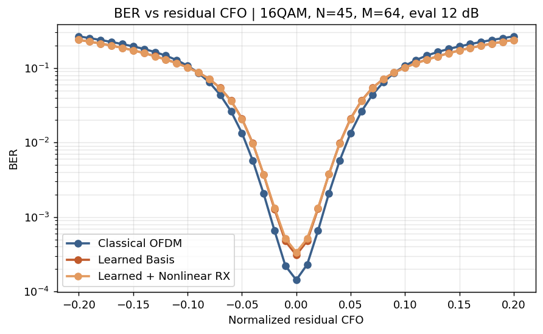

### Ber Vs Snr By Cfo

[ber_vs_snr_by_cfo.png](ber_vs_snr_by_cfo.png)

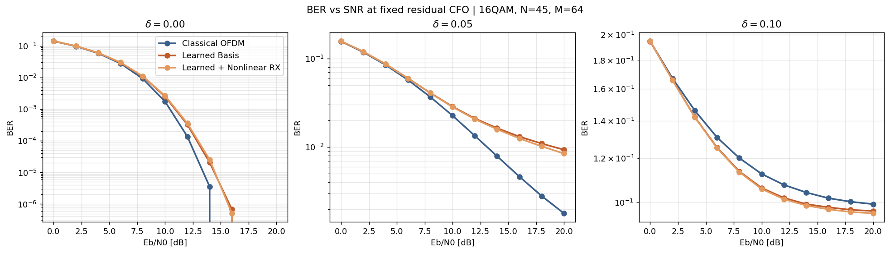

### Offdiag Leakage Vs Cfo

[offdiag_leakage_vs_cfo.png](offdiag_leakage_vs_cfo.png)

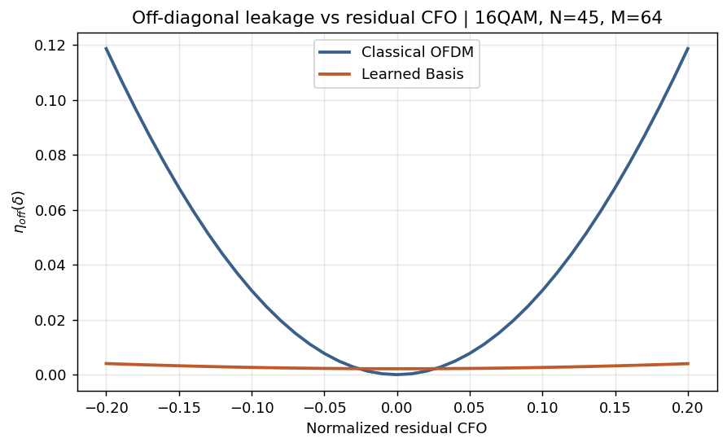

### Nearest Neighbor Leakage Vs Cfo

[nearest_neighbor_leakage_vs_cfo.png](nearest_neighbor_leakage_vs_cfo.png)

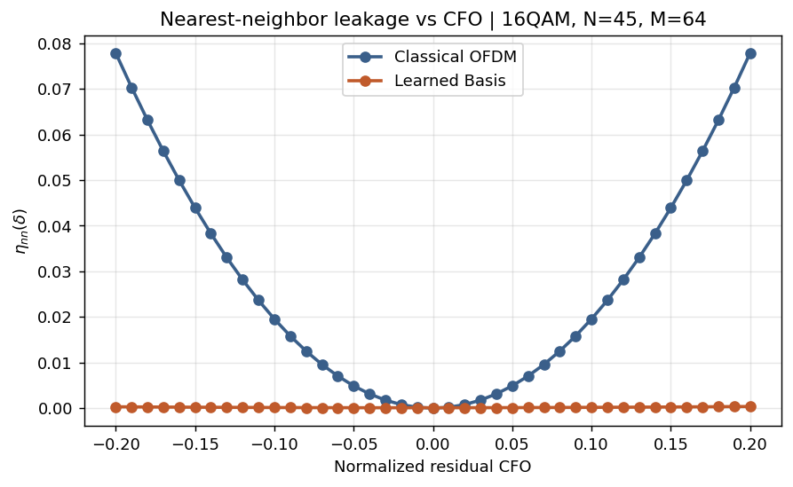

### Evm Vs Cfo

[evm_vs_cfo.png](evm_vs_cfo.png)

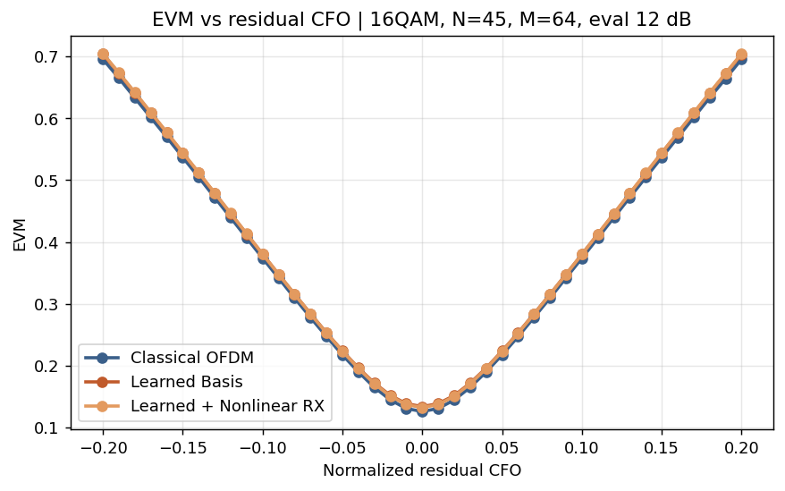

### Constellation Snapshots

[constellation_snapshots.png](constellation_snapshots.png)

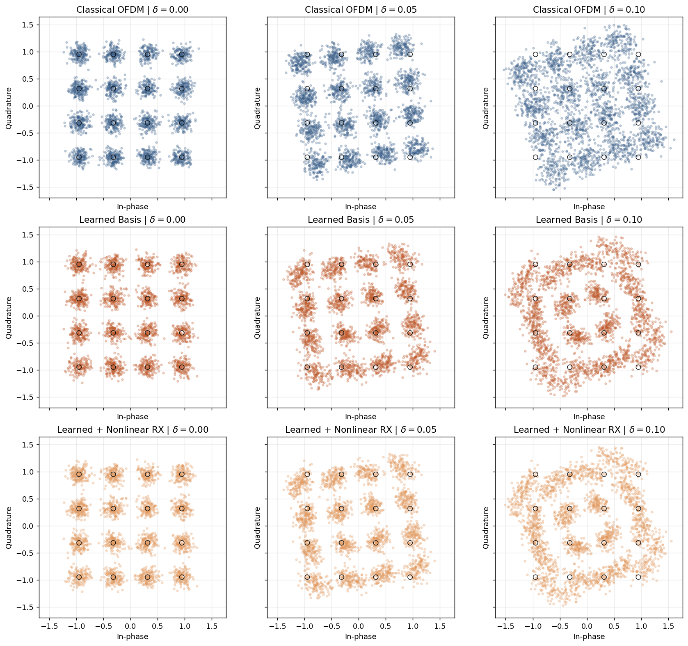

### Operator Heatmaps

[operator_heatmaps.png](operator_heatmaps.png)

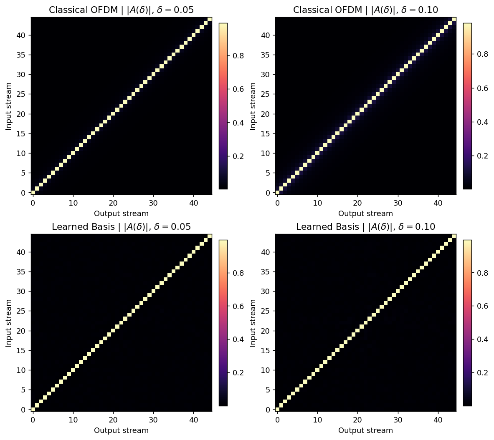

### Spectral Fairness

[spectral_fairness.png](spectral_fairness.png)

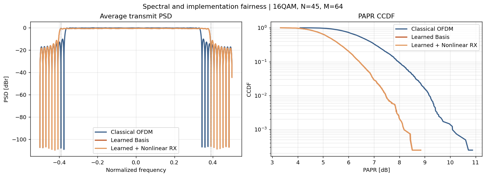

### Papr Ccdf

[papr_ccdf.png](papr_ccdf.png)

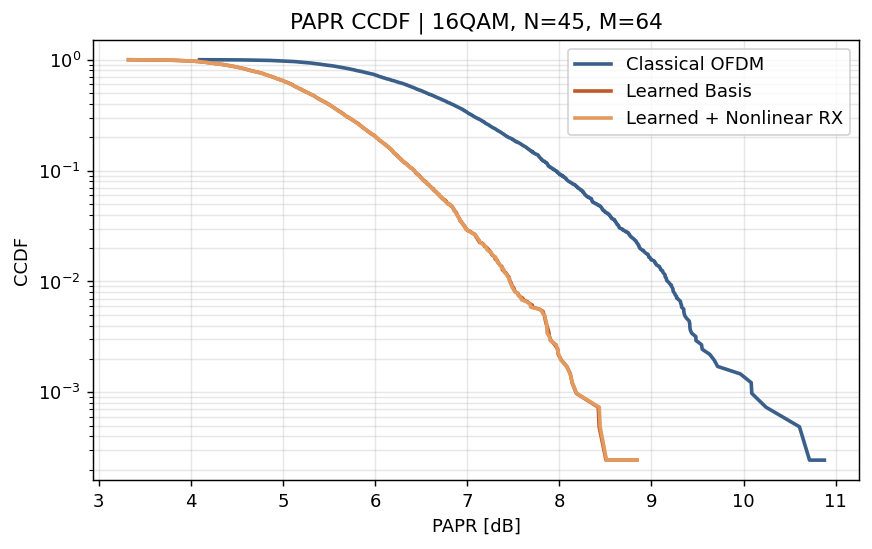

### Frequency Domain Bases All

[frequency_domain_bases_all.png](frequency_domain_bases_all.png)

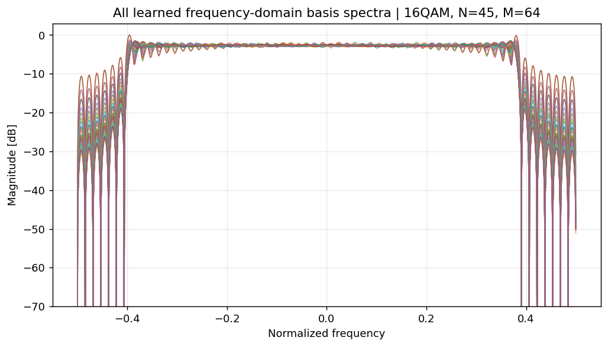

### Frequency Domain Bases Random

[frequency_domain_bases_random.png](frequency_domain_bases_random.png)

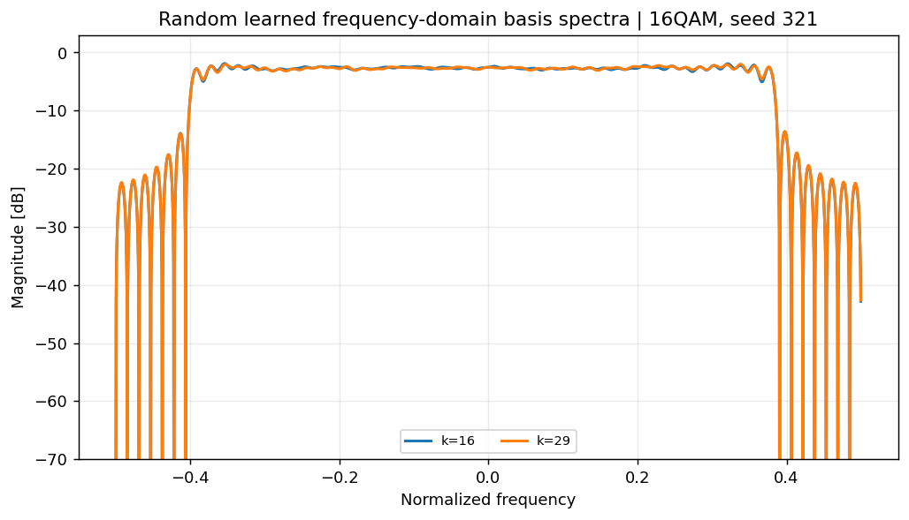

### Time Domain Waveform

[time_domain_waveform.png](time_domain_waveform.png)

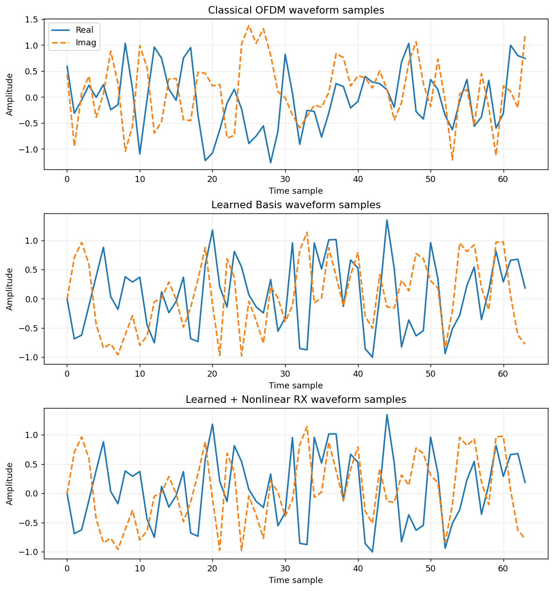

### Time Domain Envelope Phase

[time_domain_envelope_phase.png](time_domain_envelope_phase.png)

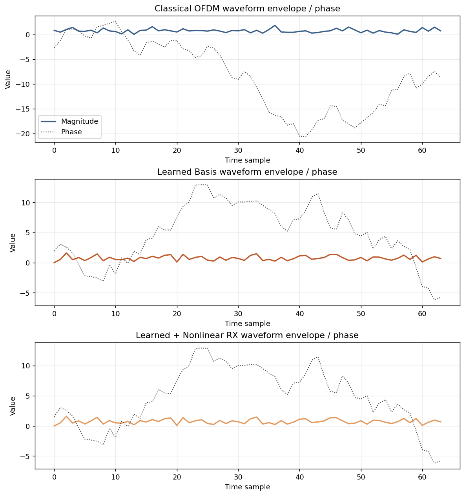
