# Residual-CFO Stage 2 Nonlinear-Only Report

- Output directory: `/Users/saksh/Documents/Local Documents/ibm/ofdm/residualCFO/idea3_stage2_awgn/stage2_nonlinear_outputs/nonlinear_only_smoke_localdet`
- Modulation: `16QAM`

Script-only Stage 2 nonlinear-only package for the structured `16QAM` experiment.
This workflow freezes the Stage 1 linear transceiver and trains only the nonlinear detector.

## Configuration

- Output dir: `/Users/saksh/Documents/Local Documents/ibm/ofdm/residualCFO/idea3_stage2_awgn/stage2_nonlinear_outputs/nonlinear_only_smoke_localdet`
- Stage 1 checkpoint: `/Users/saksh/Documents/Local Documents/ibm/ofdm/residualCFO/idea3_stage2_awgn/stage1_linear_outputs/16qam_smoke_localdet/stage1_checkpoint.pt`
- Base seed: `211`
- Frame: `M=64, K=50, N=45, P=4, G=10, R=5`
- Workflow: `nonlinear_only`
- Train SNR: `15.0 dB`, train range `[10.0, 18.0] dB`, eval SNR `12.0 dB`
- Nonlinear-only stage: epochs `40`, lr `0.001`, freeze `W` and `V`
- Detector: `local` with channels `32`, kernel `5`, residual scale init `0.1`
- Features: confidence `True`, symbol correction head `True`
- Losses: hard-CFO weight `1.0`, non-inferiority `0.25`, eta `0.01`
- Hard-CFO checkpoint target: abs CFO `(0.05, 0.1)` with weights `(0.35, 0.65)`
- Structured occupancy: learned-data `0.781`, information `0.703`, guard `0.156`

## Mapping Summary

**Stage 2 Nonlinear Mapping (nonlinear_only)**

$z_0 = V y,\quad (\hat{s}, \ell) = R_\theta(z_0)$

- The Stage 1 linear receiver remains the interpretable front-end.
- The nonlinear receiver is a local symbol-domain detector with geometry-anchored `16QAM` logits, neighborhood mixing, and an optional weak symbol-correction head.
- `nonlinear_only` freezes `W` and `V` and trains only `R_theta`.
- `joint` first trains `R_theta` with frozen `W,V`, then optionally reopens `V` while keeping `W` fixed.
- BER is decoded from the nonlinear logits head, while EVM continues to use corrected complex-symbol estimates.

## Run Summary

**Stage 2 Nonlinear Comparison Summary (nonlinear_only)**
- Configuration: `16QAM`, `N=45`, `M=64`, train `15 dB`, eval `12 dB`.
- Stage 1 checkpoint: `/Users/saksh/Documents/Local Documents/ibm/ofdm/residualCFO/idea3_stage2_awgn/stage1_linear_outputs/16qam_smoke_localdet/stage1_checkpoint.pt` with structured `K=50` subspace and redundancy `R=5`.
- NonlinearOnly: best epoch `1`, val total `4.2282e+00`, val BER `2.2483e-02`, hard-CFO weighted BER `7.0608e-02`, residual scale `0.1000`, clean identity `1.6871e-03`, clean leakage `1.4529e-03`.
- Learned BER at CFO `0.00`: linear `1.519e-04` vs nonlinear `1.519e-04` (delta `+0.000e+00`).
- Learned BER at CFO `0.05`: linear `9.592e-03` vs nonlinear `9.549e-03` (delta `-4.340e-05`).
- Learned BER at CFO `0.10`: linear `1.025e-01` vs nonlinear `1.025e-01` (delta `+4.340e-05`).
- Stage 2 beat `stage1_linear` at CFO `0.05`.
- Stage 2 did not beat `stage1_linear` at CFO `0.10`; the nonlinear branch underperformed there.
- Stage 2 avoided a BER regression at zero CFO.
- Against the classical baseline at CFO `0.10`: learned linear `1.025e-01`, learned nonlinear `1.025e-01`, OFDM `1.056e-01`.
- Learned robustness window BER <= `0.01`: linear `|delta|<=0.040` vs nonlinear `|delta|<=0.040`.
- Learned EVM at CFO `0.10`: linear `0.3783` vs nonlinear `0.3783`.
- Learned spectral check: OOB linear `1.2998e-02`, nonlinear `1.2998e-02`.
- Learned PAPR check: linear `6.63 dB`, nonlinear `6.63 dB`.

## Data Artifacts

- `ber_csv`: [ber_vs_cfo.csv](ber_vs_cfo.csv)
- `ber_snr_csv`: [ber_vs_snr_by_cfo.csv](ber_vs_snr_by_cfo.csv)
- `constellation_csv`: [constellation_snapshots.csv](constellation_snapshots.csv)
- `diagonal_csv`: [diagonal_magnitudes.csv](diagonal_magnitudes.csv)
- `history_csv`: [stage_training_history.csv](stage_training_history.csv)
- `operator_csv`: [operator_diagnostics.csv](operator_diagnostics.csv)
- `papr_csv`: [papr_samples.csv](papr_samples.csv)
- `papr_summary_csv`: [papr_summary.csv](papr_summary.csv)
- `snr_summary_csv`: [ber_vs_snr_slice_summary.csv](ber_vs_snr_slice_summary.csv)
- `spectral_csv`: [spectral_psd.csv](spectral_psd.csv)
- `spectral_summary_csv`: [spectral_summary.csv](spectral_summary.csv)
- `stage_summary_csv`: [stage_summary.csv](stage_summary.csv)
- `summary_csv`: [summary_metrics.csv](summary_metrics.csv)

## Model Artifacts

- `stage1_checkpoint`: [stage1_checkpoint.pt](../../stage1_linear_outputs/16qam_smoke_localdet/stage1_checkpoint.pt)

## Figures

### Ber Vs Cfo

[ber_vs_cfo.png](ber_vs_cfo.png)

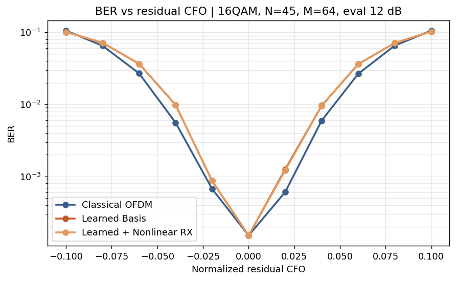

### Ber Vs Snr By Cfo

[ber_vs_snr_by_cfo.png](ber_vs_snr_by_cfo.png)

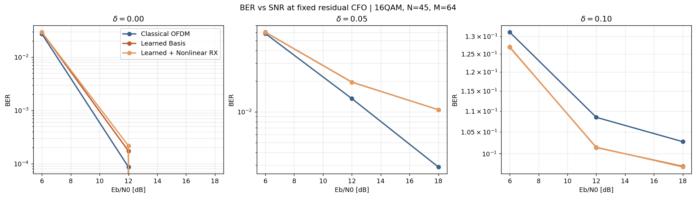

### Offdiag Leakage Vs Cfo

[offdiag_leakage_vs_cfo.png](offdiag_leakage_vs_cfo.png)

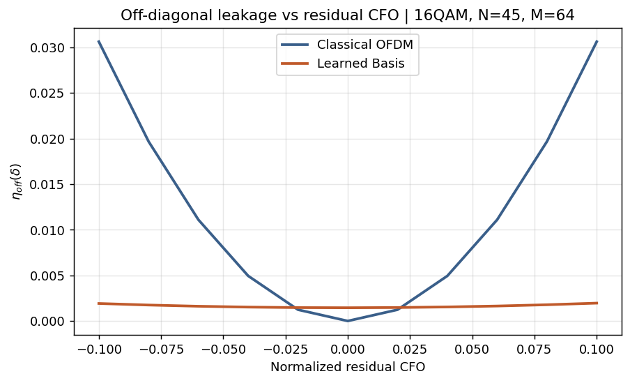

### Nearest Neighbor Leakage Vs Cfo

[nearest_neighbor_leakage_vs_cfo.png](nearest_neighbor_leakage_vs_cfo.png)

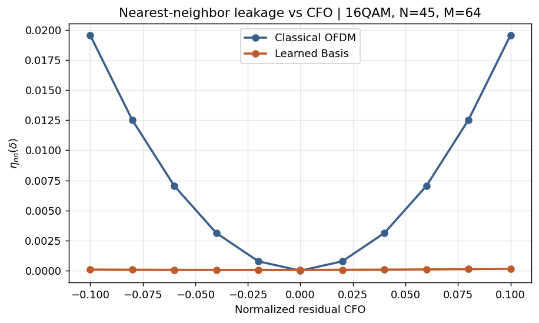

### Evm Vs Cfo

[evm_vs_cfo.png](evm_vs_cfo.png)

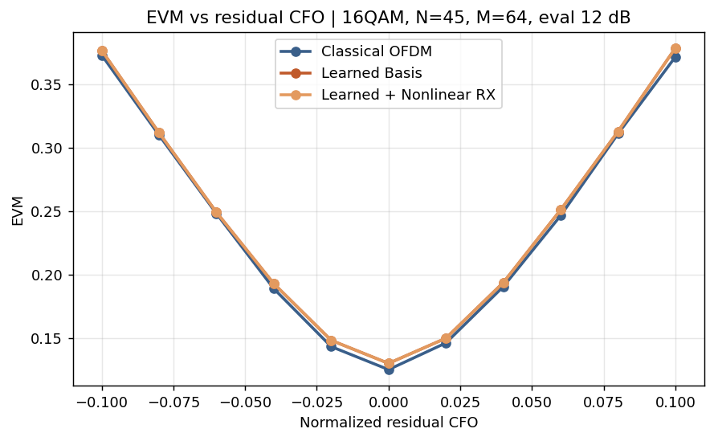

### Constellation Snapshots

[constellation_snapshots.png](constellation_snapshots.png)

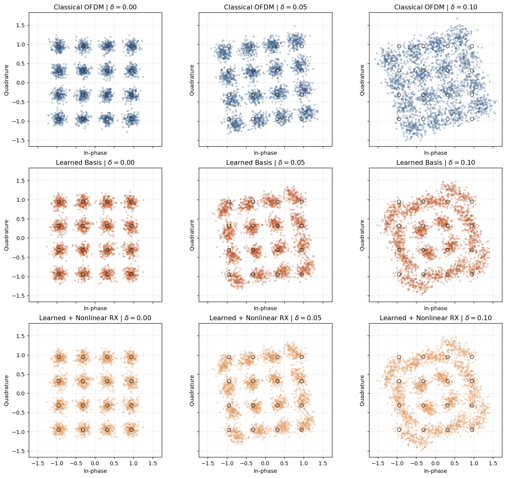

### Operator Heatmaps

[operator_heatmaps.png](operator_heatmaps.png)

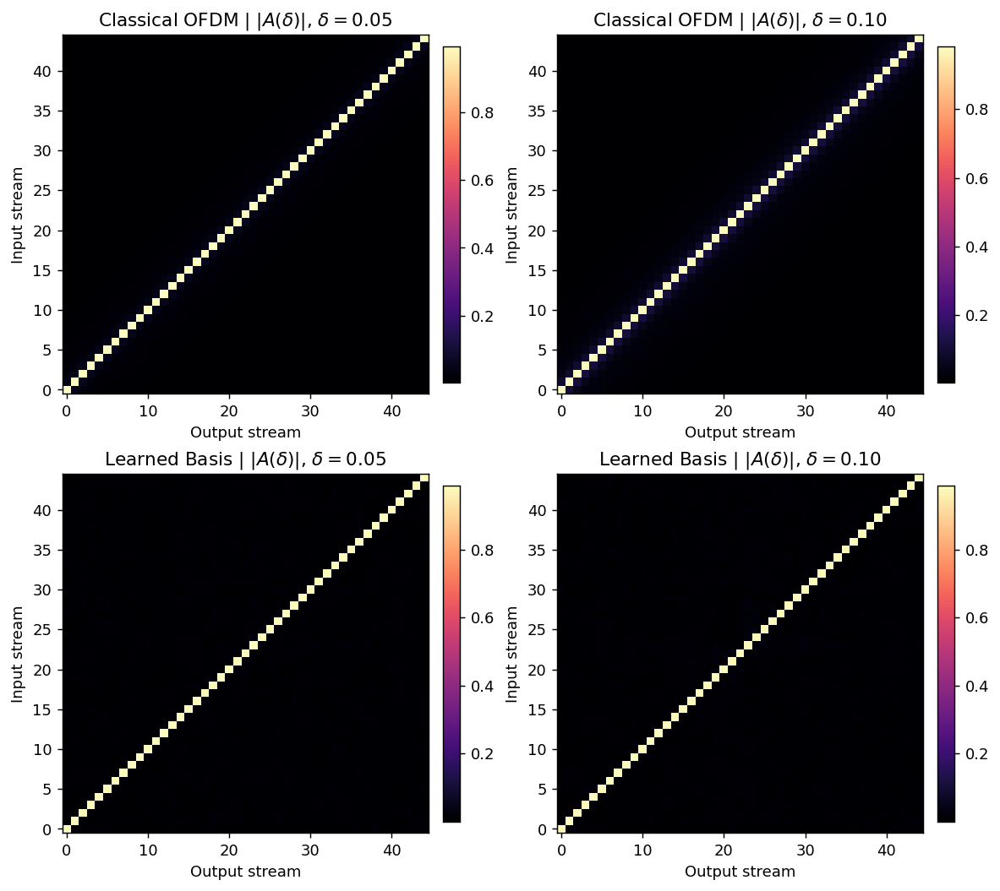

### Spectral Fairness

[spectral_fairness.png](spectral_fairness.png)

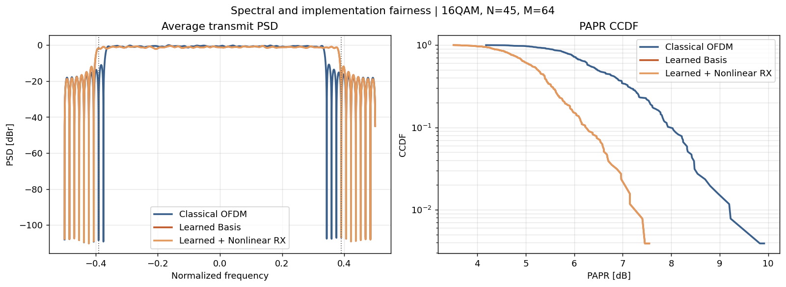

### Papr Ccdf

[papr_ccdf.png](papr_ccdf.png)

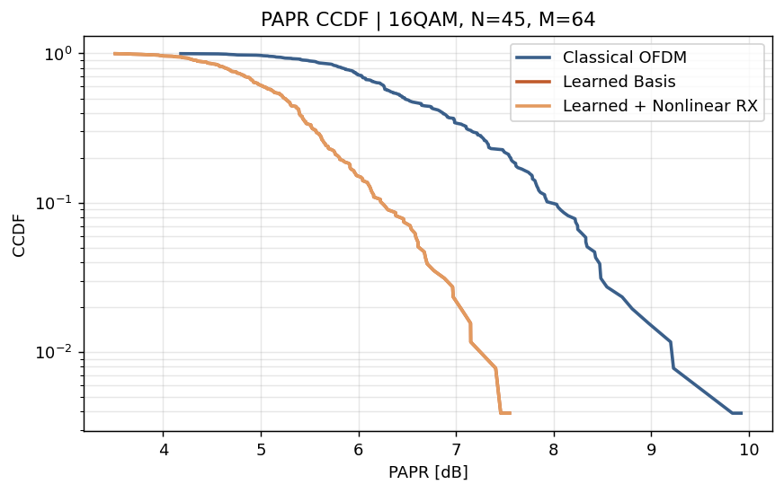

### Frequency Domain Bases All

[frequency_domain_bases_all.png](frequency_domain_bases_all.png)

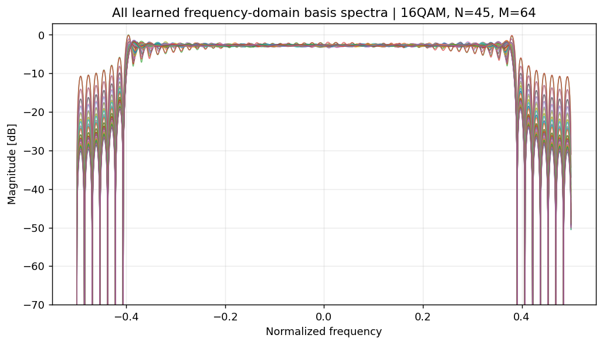

### Frequency Domain Bases Random

[frequency_domain_bases_random.png](frequency_domain_bases_random.png)

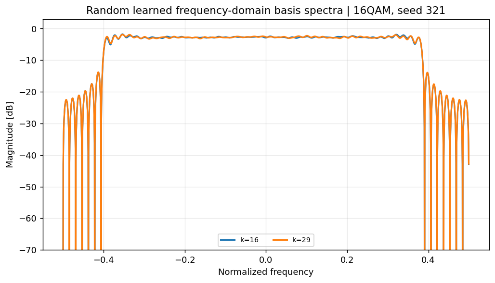

### Time Domain Waveform

[time_domain_waveform.png](time_domain_waveform.png)

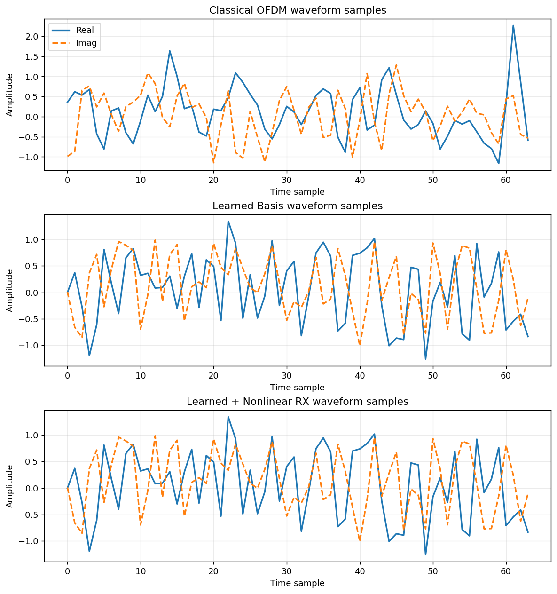

### Time Domain Envelope Phase

[time_domain_envelope_phase.png](time_domain_envelope_phase.png)

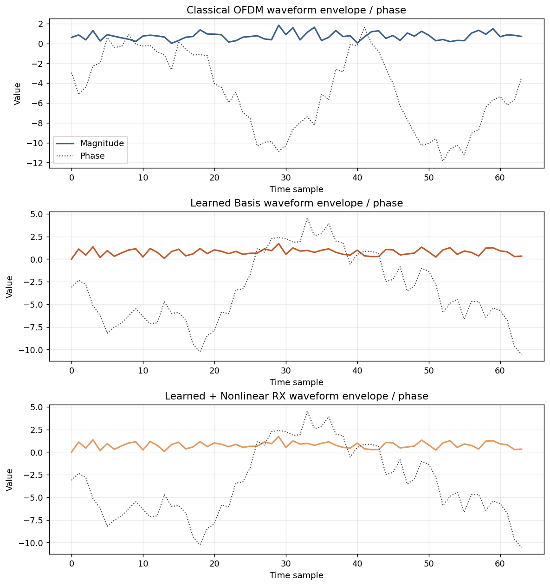
